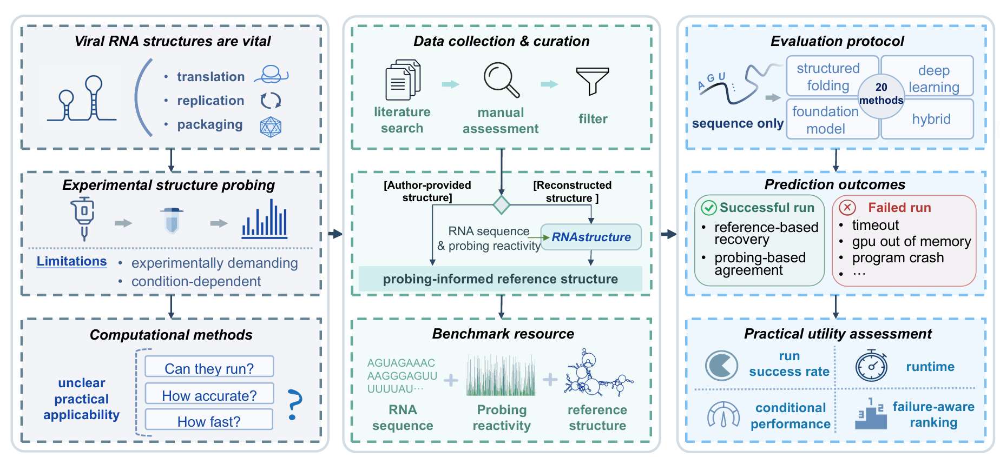

# RNAViral-Bench

Benchmarking RNA secondary structure prediction methods on **full-length viral RNA genomes and genomic segments**.

The benchmark contains **28 viral RNA records** ranging from **890 nt to 29,903 nt** and evaluates **20 prediction methods** using reference structures, chemical probing data, runtime, and prediction success/failure information.

<p align="center">
  
</p>

## Repository structure

```text
RNAViral-Bench/
├── data/               # Sequences, reference structures, probing data, and runtime records
├── methods/            # Installation and prediction notebooks for each method
├── predict_results/    # Predicted RNA secondary structures
├── analysis/           # Evaluation and visualization notebooks
├── LICENSES/           # Full license texts
├── LICENSE.md          # Licensing summary
└── README.md
```

## Data

The `data/` directory contains the files used for evaluation:

* `viruses.fasta` — RNA sequences and reference secondary structures
* `probing_scores.csv` — per-nucleotide chemical probing reactivities
* `runtime.xlsx` — runtime and execution status for each method–RNA pair

The benchmark includes 28 viral RNA records from six virus families.

## Methods

The 20 evaluated methods are grouped as follows:

| Group                  | Methods                                                                                                                          |
| ---------------------- | -------------------------------------------------------------------------------------------------------------------------------- |
| **Structured folding** | CONTRAfold, EternaFold, CENTROIDFOLD, ProbKnot, RNAstructure, ShapeKnots, RNAfold, pKiss, RNAshapes, LinearFold, LinearPartition |
| **Deep learning**      | SPOT-RNA, RFold                                                                                                                  |
| **Foundation models**  | ERNIE-RNA, RNA-FM, RiNALMo                                                                                                       |
| **Hybrid methods**     | rna-state-inf, MXfold2, KnotFold, BPfold                                                                                         |

Each notebook in `methods/` contains the installation instructions, prediction commands, and output conversion used in the benchmark.

Third-party prediction software and pretrained model weights are **not redistributed** in this repository.

## Prediction results

`predict_results/` contains the secondary structures generated by the evaluated methods in a common FASTA-like format.

Each record contains:

```text
>RNA_identifier
SEQUENCE
DOT-BRACKET_STRUCTURE
```

## Analysis

The main analysis notebooks are located in `analysis/`:

* `metrics_computation.ipynb` — reference-based and probing-based evaluation
* `runtime_performance.ipynb` — runtime, prediction status, and failure-aware ranking
* `pairing_distance_stratified_recall.ipynb` — recall stratified by base-pair distance

Run `metrics_computation.ipynb` first to generate the intermediate evaluation results used by the other analysis notebooks.

## License

Unless otherwise indicated, the benchmarking notebooks, execution wrappers, analysis code, and visualization code are licensed under the **GNU General Public License v3.0 only (GPL-3.0-only)**.

Parts of the benchmarking framework were adapted from [`sinc-lab/lncRNA-folding`](https://github.com/sinc-lab/lncRNA-folding).

`methods/ct2dot.py` is separately licensed under the **GNU General Public License v2.0 only (GPL-2.0-only)**. It is a Python port/adaptation of pseudoknot-aware dot-bracket conversion functionality from RNAstructure.

Third-party prediction software is not redistributed and remains subject to its respective upstream license.

See `LICENSE.md` and `LICENSES/` for details.

## Citation

Citation information will be added upon publication.
